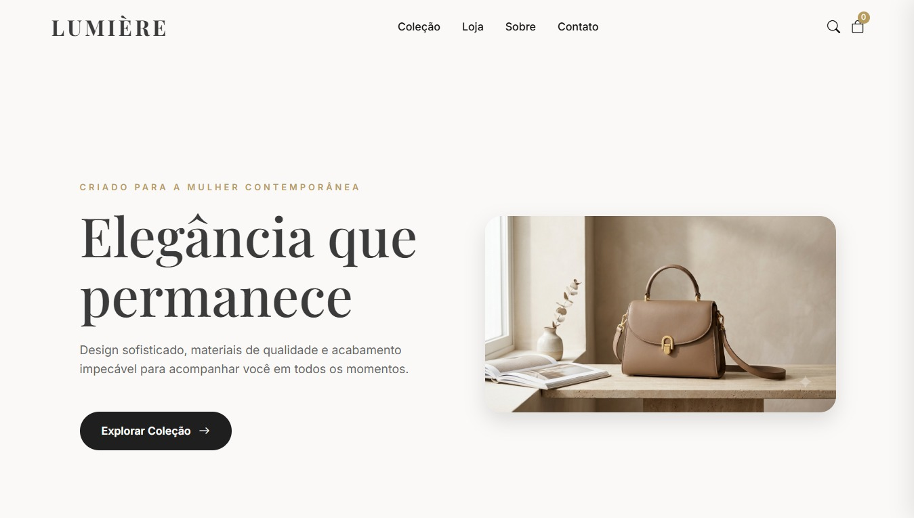

<div align="center">


<br/>

<a href="https://github.com/ruthdosanjos">

</a>

<br/>

<p>


</p>

<p>


</p>

</div>

---

# Sobre

Comecei minha carreira em suporte técnico e infraestrutura, atuando com troubleshooting de redes e atendimento N1. Essa experiência me ensinou a pensar em sistemas, confiabilidade e causas-raiz antes mesmo de trabalhar com interfaces.

Hoje curso Análise e Desenvolvimento de Sistemas e me especializo em Front-end com React e JavaScript, aplicando essa mesma disciplina na construção de interfaces modernas, acessíveis e escaláveis.

Minha formação em Humanidades (UFRN) complementa essa base técnica, trazendo uma visão centrada no usuário e no contexto de uso das aplicações.

Meu objetivo é desenvolver produtos que unam boa experiência, arquitetura consistente e qualidade de código.

---

# Atualmente

- Desenvolvendo a Lumière Bags
- Construindo a Astera Studio
- Estudando TypeScript e Next.js
- Evoluindo em arquitetura Front-end

---

# Stack

### Front-end


### Arquitetura & Ferramentas


### Infraestrutura


### Estudando


---

# Projetos em destaque

## 🛡️ SOC Dashboard

<div align="center">

</div>

Painel inspirado em ambientes de Security Operations Center para monitoramento de eventos de segurança, status de rede e indicadores operacionais.

O projeto demonstra componentização em React, organização de interfaces orientadas a dados e preocupação com estados de UI, legibilidade e escalabilidade.

**Stack**

React • JavaScript • CSS • Vercel

**Destaques técnicos**

- Componentização escalável
- Interfaces orientadas à tomada de decisão
- Estados de loading, erro e dados vazios
- Organização de arquitetura Front-end

<p>
<a href="https://dashboard-soc-lovat.vercel.app/">

</a>

<a href="https://github.com/ruthdosanjos/soc-dashboard">

</a>
</p>

---

## 👜 Lumière Bags

<div align="center">

</div>

E-commerce fictício de bolsas desenvolvido para demonstrar arquitetura Front-end utilizando HTML5, CSS Modular e JavaScript Vanilla.

O projeto enfatiza organização de código, componentes reutilizáveis, responsividade, acessibilidade, performance e gerenciamento de estado utilizando LocalStorage.

**Stack**

HTML5 • CSS Modular • JavaScript • Vercel

**Destaques técnicos**

- Arquitetura CSS modular
- JavaScript organizado por responsabilidades
- Carrinho persistente com LocalStorage
- Componentes reutilizáveis
- Layout totalmente responsivo
- Boas práticas de acessibilidade

<p>
<a href="https://lumiere-bags.vercel.app/">

</a>

<a href="https://github.com/ruthdosanjos/lumiere-bags">

</a>
</p>

---

# Jornada

```text
Suporte Técnico N1
        │
        ▼
Redes & Cybersecurity
(CCST Cisco)
        │
        ▼
Front-end
(React • JavaScript • Arquitetura)
```

---

# Certificações

- Cisco CCST Networking
- Cisco CCST Cybersecurity

---

<div align="center">

# Contato

<p>
<a href="mailto:ruthinhaemilly@hotmail.com">

</a>

<a href="https://www.linkedin.com/in/ruth-dos-anjos">

</a>

<a href="https://github.com/ruthdosanjos">

</a>
</p>

<sub>Building modern interfaces with an infrastructure mindset.</sub>

</div>
