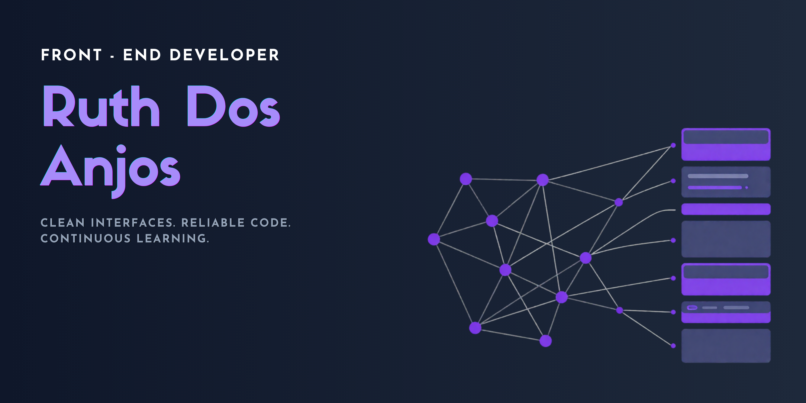
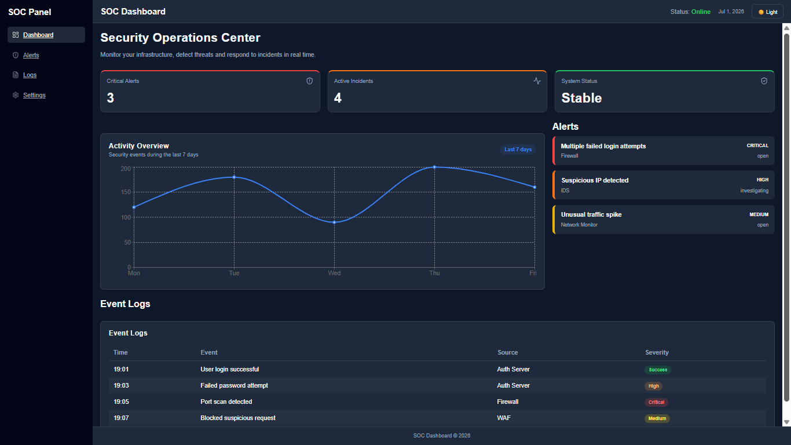

<div align="center">

<!-- ===================== HERO / BANNER ===================== -->


<br/>

<!-- ===================== TYPING ANIMATION ===================== -->
<a href="https://github.com/ruthdosanjos">
  
</a>

<br/>

<!-- ===================== BADGES ===================== -->
<p>
  
  
  
</p>

<p>
  
  
</p>

<br/>

</div>

<!-- ===================== ABOUT ME ===================== -->
## Sobre

Comecei resolvendo problemas de rede e atendendo chamados de suporte N1, foi ali que aprendi a pensar em sistemas, causas-raiz e confiabilidade antes de pensar em interfaces. As certificações Cisco em Networking e Cybersecurity vieram desse período e moldaram a forma como hoje encaro front-end: não como camada visual isolada, mas como parte de um sistema que precisa ser estável, seguro e bem estruturado.

Hoje curso Análise e Desenvolvimento de Sistemas e me dedico a React, JavaScript e arquitetura de interfaces, unindo essa base técnica a uma formação em Humanidades (UFRN) que me dá leitura de contexto e de usuário, algo que considero parte natural do trabalho de front-end, não um "extra".

Meu foco atual: construir interfaces limpas e escaláveis com a mesma disciplina que antes eu aplicava para manter uma rede no ar.

<br/>

<!-- ===================== TECH STACK ===================== -->
## Stack

**Front-end**


**Tools**


**Infra / Networking mindset**


**Aprendendo agora**


<br/>

<!-- ===================== PROJETO DESTAQUE ===================== -->
## Projeto em destaque

<div align="center">

</div>

### 🛡️ SOC Dashboard

Painel de monitoramento inspirado em ambientes de **Security Operations Center**, criado para visualizar eventos de segurança, status de rede e indicadores operacionais em tempo real — unindo diretamente minha base em redes/segurança com front-end moderno.

Não é um projeto de curso: foi pensado como um produto real, com atenção a hierarquia de informação, legibilidade de dados críticos e performance de renderização — pontos que aprendi a valorizar atuando com suporte técnico e infraestrutura.

**Destaques técnicos**
- Visualização de dados orientada a decisão rápida (interfaces de monitoramento exigem clareza sob pressão)
- Componentização em React pensada para escalar novos painéis sem retrabalho
- Atenção a estados de UI (loading, erro, dados vazios) — comum em ferramentas de operação real

**Stack:** React · JavaScript · CSS · Vercel

<p>
  <a href="https://dashboard-soc-lovat.vercel.app/">
    
  </a>
  <a href="https://github.com/ruthdosanjos">
    
  </a>
</p>

<br/>

<!-- ===================== OUTRO PROJETO ===================== -->
## Outros projetos

<table>
<tr>
<td width="100%">

**🛍️ Lumière Bags**

E-commerce front-end com fluxo de listagem, carrinho e navegação de produtos, com foco em usabilidade e organização de componentes.

<div align="center">

</div>

[Ver demo →](https://projeto-loja-jet.vercel.app)

</td>
</tr>
</table>

<!-- ===================== ROADMAP / JORNADA ===================== -->
## Jornada

```
Suporte Técnico N1  ──▶  Redes & Cybersecurity  ──▶  Front-end / React
  troubleshooting          CCST Cisco               interfaces com
  redes, atendimento       Networking + Security     base de infra
```

| Fase | Foco | Resultado |
|---|---|---|
| 01 | Suporte Técnico N1 | Diagnóstico, redes, resolução de problemas sob pressão |
| 02 | Redes & Cybersecurity | Certificações Cisco CCST — visão de sistemas e segurança |
| 03 | Front-end & React | Construção de interfaces com mentalidade de confiabilidade |

<br/>

<!-- ===================== CERTIFICAÇÕES ===================== -->
## Certificações

- **Cisco CCST Networking** — fundamentos de redes, protocolos e infraestrutura
- **Cisco CCST Cybersecurity** — fundamentos de segurança da informação

<br/>

<!-- ===================== CONTATO ===================== -->
<div align="center">

## Contato

<p>
  <a href="https://www.linkedin.com/in/ruth-dos-anjos">
    
  </a>
  <a href="https://github.com/ruthdosanjos">
    
  </a>
</p>

<br/>

<sub>Ruth Dos Anjos — construindo interfaces com base em infraestrutura e segurança.</sub>

</div>
